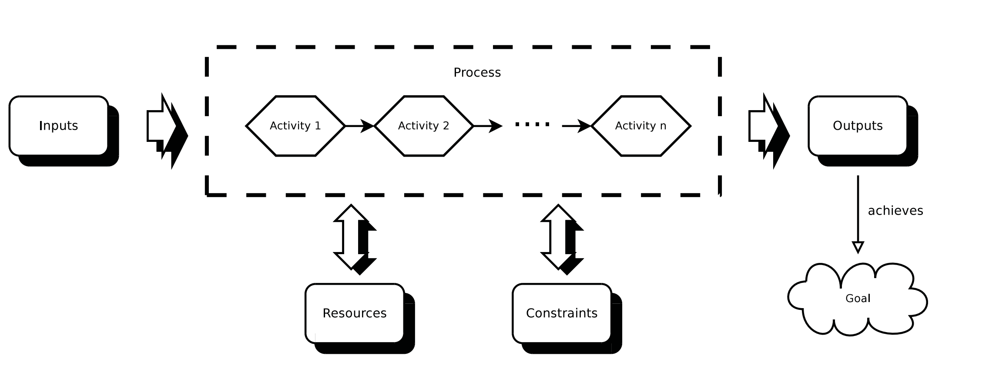

# Intro to software engineering/development

_updated at: 2017-05-10-17-15_

## SE

### what is software
+ both a solution and a problem
    * how to dev
    * how to dev free of bugs

### SE
+ def
    * the application of engineering (systematic, disciplined, quantifiable)  principles to the development, operation, and maintenance of software and
    * the study of how
+ why we need SE
    * sw is becoming more and more complex
+ steps
    - identify the problem
    - analyse the problem
    - derive solutions to the problem
    - most appropriate solution
    - realise the solution

### sw sys
+ def
    + a set of programs, hardware components, networks and other devices that are inter-connected and work together to acheive a common goal
+ design
    + physical layout
    + reliability of components
    + performance of components
    + other factor

### failure reason in sw proj
+ misunderstanding of requirements
+ design failures
+ proj management failures
+ other

### CS vs SE
+ critical difference
    * CS is a science, while SE is an engineering method.
    * CS is the __theoretical foundation__ on which software engineering is built.
    * SE __applies__ the results from computer science as problem-solving tools
+ inherent difference
    * __complexity__
        - CS: solve __small-scale__ problems regarding certain computational problems
        - SE: build and manage __large-scale__ systems

### SE vs other Engineering
+ similarity
    * building reliable products that solve some problem
    * use knowledge, assure quality, reduce building&maintaining cost
    * large team, large scale products
    * suffer from requirements changes
+ diff
    * age
    * cost
    * flexibility
    * innovation
    * domain specificity
    * complexity
    * reliability

## sw process

### what is a process
+ A process is a set of ordered __activities__, containing __inputs__, __outputs__, constraints, and resources, enacted for the purpose of achieving a specified goal.
+ a abstract model of a process
    * 
    * _model_,_modelling_
        - A model is a simplified description of an entity or process to help understand and solve the problem

### Examples of processes
+ Software Engineering itself
+ Requirements Engineering
+ Software life cycle models
    * waterfall life cycle process
    * V-model model life cycle process
+ Checking source code into a repository

### Why do we need processes?
+ influences how the project is managed
    * how to achieve the goal
        - proj planning task
            + what goal
            + how to achieve
            + provided structuredly by a model
            + so as to find best-suited processes

### Process Management
+ overlap of Process Groups
    * Initiating processes
    * Planning processes
    * Executing processes
    * Closing processes

## Project Management

### What is a project?
a collaborative enterprise, frequently involving research or design,
that is carefully planned to achieve a particular aim

### What is project management?
+ The application of skill or care in the manipulation, use, treatment, or control of a collaborative enterprise that is carefully planned to achieve a particular aim.
+ being careful in the way that we run our projects, so that they achieve their
aims

### Project Management via monitoring and controlling
In software engineering, projects are managed using two _overlapping and related_ disciplines (so we need to integrate them): monitoring and controlling.

+ monitor
    * what is happening
    * when is it
    * to make timely and informed decisions
+ control
    * by planning and implementing the decision
+ connecting monitoring and controlling
    - simple form
    - more complicated form involved with human beings
