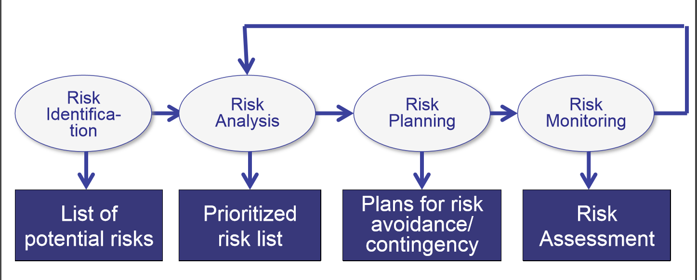
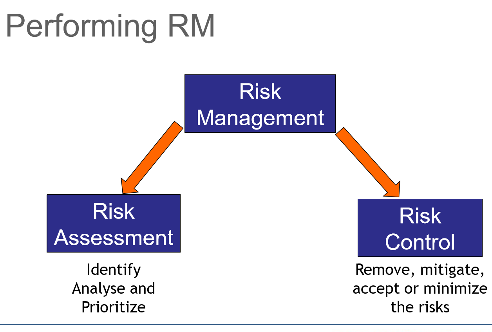
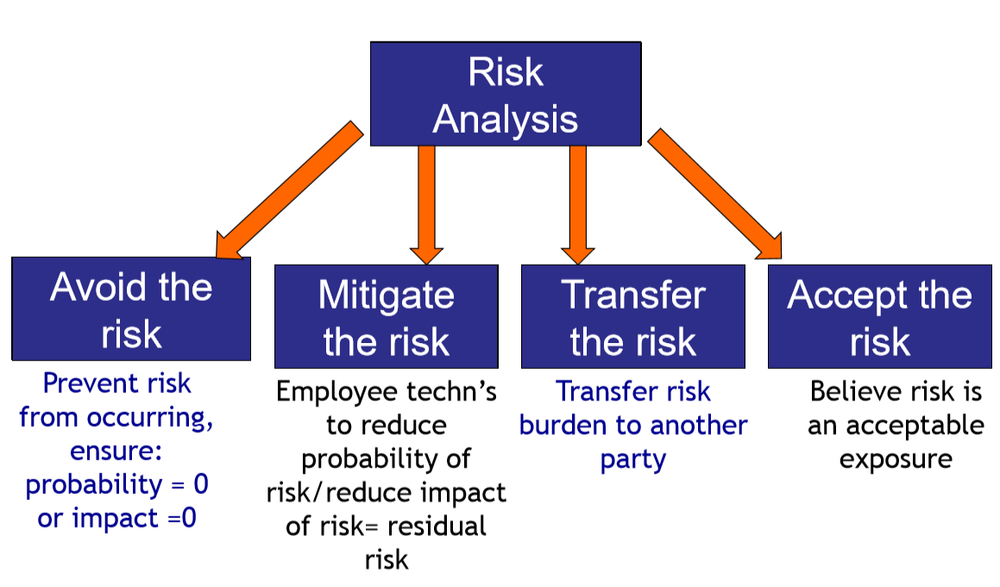

# Risk & Risk
 Management

_updated at: 2017-05-22-21-09_

+ Risk Management most important for PM
    * All PM is risk management
+ Iterative process
    * 
        * Risk management is not a task that is undertaken only at the initial stages of a project. It is an iterative and ongoing activity, in which one is continually assessing, controlling, and monitoring the risks in the project

##Risk in PM
+ Risks
    * may threaten the project/software
        - bring
            + uncertainty
            + loss
    * Need to be managed properly
        - we need to get prepared
            + plan for the risk events & manage
                * be proactive
                    - ~~starts early in PM~~
                    - ~~Identify potential risks (anticipate)~~
                    - ~~Assess their probability & impact~~
                    - ~~Prioritize the risks~~
                    - ~~Take steps to avoid risks~~
                    - ~~Draw up a contingency plan~~
- risk != uncertainty
    + Can have uncertainty without risk, but not risk without uncertainty
    + _A risk with a probability of 1 is a problem._
- Categories of Risk in PM
    + Project Risks
    + Product including technology risks
    + Business Risks
- Properties of Risk
    + probability
    + impact
    + degree of control
        * over the event & its outcome
+ Risk exposure
    * risk exposure = probability * impact
        - impact is quantifiable
            + useful for prioritisation to order
        - Risk free event

## Risk Management
+ anticipate risks & take appropriate action
+ Reduce impact of risk through Risk Management
+ Most important job of a PM
+ 
+ 
+ 
+ two broad categories
    * Risk assessment
        - identifying
            + combination of
                * Pondering
                * Interviews/questionnaires
                * Brainstorming
                * Checklist
                    - risk types
                        - Estimation risks
                        - Organisational risks
                        - People risks
                        - Requirements risks
                        - Technology risks
                        - Tools risk
            - HAZOP
                + ~~Hazard and operability studies~~
                + keyword-driven
                + ~~applying guidewords to parameters,~~ "what if"
                    * guidewords
                        * a deviation of the design intent 
                    * ~~parameters~~
                        - ~~dependent on the domain~~
            - after all identified, can be classified and placed in a risk register/log
                + allows defing responses to the risks for closely related risks
                    * a single strategy for dealing with a risk can also mitigate several related risks
        - analysing
            + 
            + estimating probability
            + estimating impact
            + identifying the root cause
        - prioritising
            - final step 
            - based on our exposure to them
            - straightforward
                - calculating the exposure, and ranking the higher exposure risks as higher priority
            + Higher priority risks require more attention and control than lower priority.
                * Make decisions wisely
    * Risk control
        - 
        - four general techniques for risk reduction
            + removing/avoiding
            + mitigating
                * results in a residual risk
            + transfering
            + accepting
        - Controlling risks can be done reactively or proactively
            - reactively
                - ~~wait until the event occurs, and then set about implementing the strategy to control it~~
            - __proactively__ - preferred
                + ~~identify the situations that may arise immediately before an event occurs, and to try to prevent the event from occurring, or reduce the impact it has on our project~~
        * Risk reduction leverage
            - 
            + assess the effectiveness of risk control
                + <1, not cost effective enough
                    * find a cost-effective alternative or accept
            * compare different plans for risk reduction
+ The job of a risk manager is to assess and control specific risks
    * generic risks
        - occurs in every project
            + Decades of experience
        * implicitly mitigated by SDLC models
            - every process in a software engineering project mitigates (or avoids) a risk
    * specific risks
        - relevant only to a particular project
        - The methods of controlling specific risks are often software engineering process themselves

## Crisis Management
+ Different from Risk Management
    * Process of dealing with an __UNPRECTED__ event that has a _negative_ impact
        - ~~have not thought about how to deal with it, may overlook~~
        - ~~a risk can become a crisis when the plan for dealing with that risk fails~~
